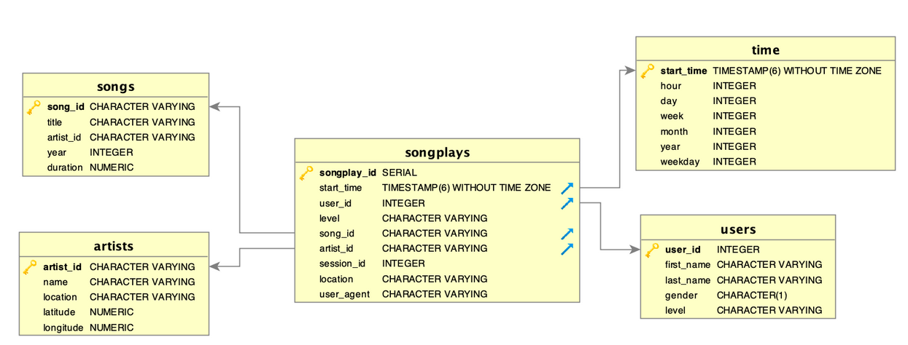

---

# Udacity training - Data modeling with Postgres

---

This is the first project of the **Data Engineer nanodegree**. It is meant to create a postgres database called **sparkifydb** for the music app **Sparkify**. 

There are two datasets in *JSON* format: the **song** and **log** datasets. The data within these two datasets is modelled into a *star schema* stored in the **sparkifydb**.

This *star schema* is optimised for queries on song play analysis.

---

# Schema design & ETL pipeline

---



There is one fact table:

- *songplays* 

This table is fed with records associated with song play facts from the log data stored within the *data/log_data* directory. This log data features activity logs from the music app **Sparkify** and is stored in JSON files.
This table's functionality is to store song play facts for song play analysis such as:

* play start_time
* play song_id
* play artist_id
* play user_id
* play session_id
* play level

and four dimension tables:

- *users*
- *songs*
- *artists*
- *time*

These four dimension tables are related to the *songplays* fact table as their primary key is a secondary one in the fact table. These tables store attributes that describe the following objects from the fact table:

* users: describes a particular user_id in the fact table, the dimension users being organized with             descriptive attributes such as name and gender
* songs: describes a particular song_id featured in the fact table, the dimension songs being organized 
  with descriptive attributes such as title and duration
* artists: describes a particular artist_id featured in the fact table, the dimension artists being organized 
  with descriptive attributes such as name and location
* time: describes in a detailed manner a particular start_time featured in the fact table, the dimension 
  time being organized with descriptive attributes such as hour and weekday

These dimension tables categorize and describe the facts from the fact table to support meaningful answers regarding the app's song plays. 

This is therefore called a dimensional modeling project.

**sql_queries.py** defines DROP, CREATE, INSERT and SELECT queries.

**create_tables.py** creates **sparkifydb** and the five above mentioned tables with create_database, drop_tables and create_tables *python* functions. This script also uses the create_table_queries & drop_table_queries modules from **sql_queries.py**.

**etl.py** carries out extract, transform and load processes in such a way:

- it processes data from the JSON song dataset through the dataset´s files (data/song_data) and sends the correct       data to the *songs* and *artists* tables.

- it processes data from the JSON log dataset through the dataset´s files (data/log_data) and sends the correct         data to the *time* and *users* tables.

- regarding the data for the *songplays* fact table, a sql query collects song and artist ids from the *songs* and     *artists* tables. This data is then combined with data from the JSON log dataset through the dataset´s files         (data/log_data). This combination then populates *songplays*.

Two directories are used:

- *data/song_data*: each file in this directory is in JSON format and contains metadata about a song and the   artist of that song. 
   
- *data/log_data*: each file in this directory is a log file in JSON format and contains data on activity        logs from the **Sparkify** app.

**ETL Process on *data/song_data***:

Through **create_tables.py**, the project's database and tables are created. Through **etl.py**, each song file is processed so that all the song information is extracted and stored into the correct columns of the previously created songs table. Same for the artist information in order to store it into the correct columns of the previously created artists table.

**ETL Process on *data/log_data***:

Through **create_tables.py**, the project's database and tables are created. Through **etl.py**, each log file is processed in order to only filter records by 'NextSong' action, to convert the timestamp column to datetime and then extract the time information and store it into the correct columns of the previously created time table, extract the user information and store it into the correct columns of the previously created users table, extract the artist and song ids from the artists and songs tables and combine this data with songplay information in order to store the combination into the correct columns of the previously created songplay table.

---

# Example queries for song play analysis

---

number of users of each gender:

```
SELECT DISTINCT gender, COUNT(gender) FROM users GROUP BY gender;
```

Hour of the day music is mostly played:

```
SELECT DISTINCT hour, COUNT(hour) FROM time GROUP BY hour;
```

---

# Sources & documentation

---

- Python documentation

- Postgres Sql documentation

- Stackoverflow

- GitHub


